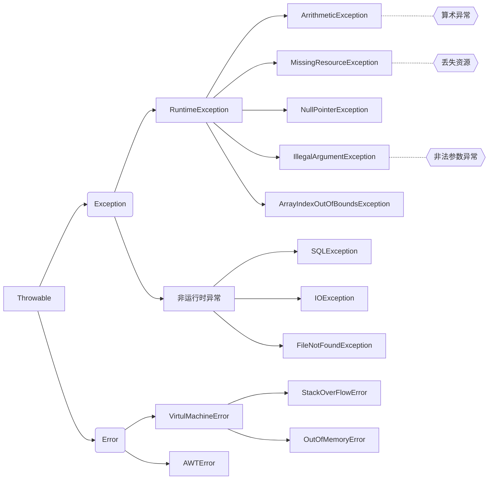
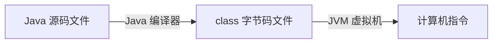
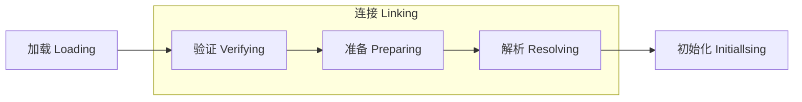
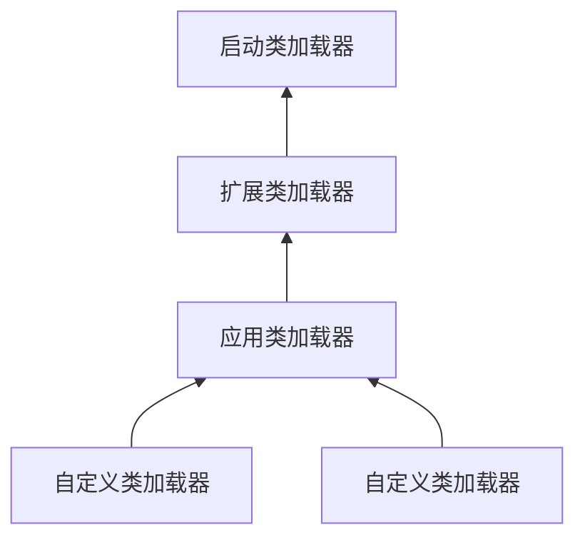

此文章的目的是为了记录自己所学，并时常进行复习

**注意：** 此文章并不是面试资料，想要有效提高面试成功率，还是得背八股文

<!-- more -->

---

参考资料：

Java 全栈知识体系&nbsp;&nbsp;&nbsp;&nbsp;&nbsp;&nbsp;&nbsp;&nbsp;&nbsp;：[https://pdai.tech/](https://pdai.tech/)

idaSmilence-javaDesign：[https://github.com/idaSmilence/javaDesign](https://github.com/idaSmilence/javaDesign)

程序员进阶之路 &nbsp;&nbsp;&nbsp;&nbsp;&nbsp;&nbsp;&nbsp;&nbsp;&nbsp;&nbsp;&nbsp;&nbsp;：
[https://tobebetterjavaer.com/](https://tobebetterjavaer.com/)

三级小野怪-设计模式&nbsp;&nbsp;&nbsp;&nbsp;：
[https://blog.csdn.net/zhengzhb/category_926691.html](https://blog.csdn.net/zhengzhb/category_926691.html)

菜鸟教程 &nbsp; &nbsp; &nbsp; &nbsp; &nbsp; &nbsp; &nbsp; &nbsp; &nbsp; &nbsp; &nbsp; &nbsp;：
[https://www.runoob.com/](https://www.runoob.com/)


# Java 基础
## 一、面向对象

### 1. 定义

> 将事务的属性及行为封装成对象，通过不同对象间的相互调用，组合解决问题

### 2. 三大特性

##### 2.1 封装

> 利用**抽象数据类型**将数据和基于数据的操作封装在一起，数据被保护在抽象数据类型内部，尽可能的隐藏内部细节，只提供一些对外接口与外部发生联系。
> 
> 用户无需知道对象内部细节，但可以通过访问外部接口来访问该对象

**优点：** 低耦合、高保密、高安全

##### 2.2 继承

> 在原有功能的基础上，既可以重写某功能，也可以拓展新的功能
>
> 所以，子类会具有父类的一般特性，也会有自身的特性

**注：** 继承必须要遵循里氏替换原则，也就是，子类可以扩展父类的功能，但不能改变父类原有的功能

##### 2.3 多态

> 同一个行为具有不同的表现形式
>
> 同一行为发生在不同对象上，会产生不同的结果

运行时多态有三个条件：**继承**、**重写**、**向上转型**

```java {7,9,15}
public class Animal {								// 父类
	public void play() {
		System.out.println("Animal.play()...");
	}
}

class Cat extends Animal {					// 子类继承父类
	@Override
	public void play() {							// 重写 play 方法
		System.out.println("Cat.play()...");
	}
}

public static void main(String[] args) {
	Animal animal = new Cat();						// 向上转型
	animal.play();									// Cat.play()...
}
```

**实现原理：**

关于重载是否属于多态，可以参考这篇文章：[重载是不是多态？重载是不是面向对象？](https://blog.csdn.net/daponi/article/details/88414438)

个人理解：

- 重载是一个类的行为的多态性的体现，而重写是父类与子类之间多态性的体现
- 重载是多态的静态绑定（编译时多态），重写是多态的动态绑定（运行时多态）

- **静态绑定**：在**编译期**确定，把方法调用与方法实现关联起来，比如方法的**重载**
- **动态绑定**：在**运行时**确定，把方法调用与方法实现关联起来，比如方法的**重写**

## 二、数据类型

### 1. 基本数据类型

| 类型      | 位数(bit) | 范围            | 默认值 | 包装类    |
| --------- | --------- | --------------- | ------ | --------- |
| `byte`    | 8         | -2^7 ~ 2^7-1    | 0      | `Byte`    |
| `short`   | 16        | -2^15 ~ 2^15-1  | 0      | `Short`   |
| `int`     | 32        | -2^31 ~ 2^31-1  | 0      | `Integer` |
| `long`    | 64        | -2^63 ~ 2^63-1  | 0L     | `Long`    |
| `float`   | 32        |                 | 0.0f   | `Float`   |
| `double`  | 64        |                 | 0.0d   | `Double`  |
| `char`    | 16        | \u0000 ~ \uffff | \u0000 | `Char`    |
| `boolean` | 1         |                 | false  | `Boolean` |

- 基本类型与其对应的包装类型之间的赋值使用**自动装箱与自动拆箱**完成
```java
Integer x = 2;     // 自动装箱 调用了 Integer.valueOf(2)
int y = x;         // 自动拆箱 调用了 x.intValue()
```

### 2. 缓存池

基本类型对应的缓冲池如下:

- boolean values true and false
- all byte values(between -128 and 127)
- short values between -128 and 127
- int values between -128 and 127
- char in the range \u0000 to \u007F

```java {4}
Integer x = new Integer(123), y = new Integer(123);
System.out.println(x == y);    // false

Integer z = Integer.valueOf(123), k = Integer.valueOf(123);
System.out.println(z == k);   // true
```

- `valueOf()` 方法的实现比较简单，就是先判断值是否在缓存池中，如果在的话就直接返回缓存池的内容
- 在**缓冲池范围内**的基本类型自动装箱过程就是调用了 `valueOf()` 方法

### 3. 引用数据类型

> 除了基本数据类型以外的类型，都是所谓的引用类型
>
> 常见的有**数组**、类、接口......

## 三、String
### 1. 概览

```java {1,4}
public final class String
    implements java.io.Serializable, Comparable<String>, CharSequence {
    /** The value is used for character storage. */
    private final char value[];
}
```

1. `String` 类被声明为 final，因此它不可被继承
2. 内部使用 char 类型保存数据，且被声明为 final，因此保证不可变

**不可变的好处：**

1. 可以缓存 hash 值 <br/>
因为 `String` 的 hash 值经常被使用，比如被用作 HashMap 的 key 值。不可变的特性使得 hash 值也不可变，因此只需要进行一次计算
2. `String Pool` 的需要 <br/>
如果一个 `String` 对象已经被创建过了，那么就会从 `String Pool` 中取得引用。只有 `String` 是不可变的，才可能使用 `String Pool`
3. 线程安全 <br/>
不可变性使得 `String` 天生具有不可变性，可以在多个线程中安全地使用

### 2. `String`、`StringBuffer`、`StringBuilder`

1. **可变性：** 
- `String` 不可变，如果尝试改变则会创建另一个对象
- `StringBuffer` 和 `StringBuilder` 是可变的
2. **线程安全性：**
- `String` 天生线程安全
- `StringBuffer` 是线程安全的，内部使用 `synchronized` 进行同步
- `StringBuilder` 线程不安全，因此最好用于单线程

### 3. intern()

> 先把当前对象放到 `String Pool`(字符串常量池)中，然后返回这个对象引用

```java
String str = "abc";			// 这种方式会自动将新建的对象放入 String Pool 中
```

```java {2,4}
String str1 = "abc";
String str2 = "abc".intern();
System.out.println(str1 == str2);		// true
str1 = "def";
System.out.println(str2);       		// abc
```

**思考一下：为什么 str2 还是 "abc"？**

## 四、泛型

### 1. 概述

> 参数化类型，就是指定形参的类型<br/>
> Java 编译器是通过先检查代码中泛型的类型，再进行类型擦除，最后编译

### 2. 类型擦除
##### 2.1 定义
> 但要知道的是，Java 的泛型是**伪泛型**，就是 Java 在编译期间，所有的泛型信息都会被擦掉，
> 如 List\<String\> 等类型，在编译之后都会变成 List。<br/>
> JVM 看到的只是 List，而由泛型附加的类型信息对 JVM 来说是不可见的。
> 因此可以通过反射添加其它类型元素

##### 2.2 意义

> 代码复用（多种数据类型执行相同的代码）

例子如下：
```java
public int add(int a, int b) { return a+b; }
public float add(float a, float b) { return a+b; }
public double add(double a, double b) { return a+b; }
// 使用泛型简化代码：
public <T extends Number> double add (T a, T b) { return a.doubleValue() + b.doubleValue(); }
```

##### 2.3 缺点

```java
List<String> strs = new ArrayList<>();
List<Integer> ints = new ArrayList<>();
/**
 * obj.getClass()方法返回的是这个对象的 Class 对象，其保存在 ArrayList.class 中
 */
System.out.println(strs.getClass() == ints.getClass());				// true，原因：类型擦除
/**
 * 有两个类：Animal 和 Dog，其中 Dog 是 Animal 的子类
 */
List<Animal> dogs = new ArrayList<Dog>();							// 报错
List<? extends Animal> dogs = new ArrayList<Dog>();					// 正确
```

##### 2.4 原始类型

> 擦除去了泛型信息，最后在字节码中的类型变量的真正类型.<br/>
> 类型变量擦除，并使用其限定类型（无限定的变量用Object）替换

### 3. 泛型方法

1. 格式定义
)
2. 调用格式
```java
Object userObj = BeanUtil.getObject("user", User.class);
```
3. 注意事项
- 泛型方法中不能直接 new 一个泛型类型，因为不知道其构造方法是怎样的，但可以利用反射的 newInstance() 方法创建

### 4. 泛型上下限

- `extends` 指定上限，只准传入本类或子孙类：`TestUtil<? extends Number> nn = new TestUtil<Integer>();`
- `super` 指定下限，只准传入本类或超类：`TestUtil<? super Integer> nn = new TestUtil<Number>();`

## 五、注解

> 自定义注解和 AOP - 通过切面实现解耦

最常见的就是使用 Spring AOP 切面 + 自定义注解，来实现**统一的操作日志管理**

**目的：** 解耦

## 六、反射
### 1. 基础概念

> 在**运行状态**中，对于任意一个类，都能够知道这个类的所有属性和方法；对于任意一个对象，都能够调用它的任意一个方法和属性；

**原理：**

> 反射就是把 java 类中的各种成分映射成一个个的 Java 对象<br/>
> 例如：将类中的方法，变量，构造函数等信息，映射成相应的 Method，Field，Constructor等。

### 2. 使用场景

1. **开发通用框架** 
> 比如通过 XML 文件配置的 JavaBean、Filter等，在运行时会加载不同的对象，调用不同的方法
2. **动态代理**
> 在 AOP 中，要拦截特定的方法，通常都会选择动态代理，而动态代理在 JDK 中就是用反射来实现的
3. **自定义注解**
> 注解本身仅仅是起到标记作用，它需要利用反射机制，根据注解标记去调用注解解释器，执行行为

### 3. 小结

1. 每个 java 类运行时都在 JVM 里表现为一个 Class 类对象
2. 反射类及反射方法的获取，都是通过从列表中搜寻查找匹配的类或方法，所以查找性能会随类的大小、方法多少而变化
3. 反射也是考虑了线程安全的，放心使用
4. 反射使用软引用 relectionData 缓存 class 信息，避免每次重新从 JVM 获取带来的开销
5. 反射调用多次生成新代理 Accessor，而通过字节码生成的则考虑了卸载功能，所以会使用独立的类加载器
6. 当找到需要的方法，都会copy一份出来，而不是使用原来的实例，从而保证数据隔离
7. 调度反射方法，最终是由jvm执行invoke0()执行

## 七、异常体系

<br/>



### 1. Throwable

Throwable 是 Java 语言中所有异常和错误的超类。

Throwable 包含了其线程创建时线程执行栈堆的快照，它提供了 printStackTrace() 等接口用户获取栈堆跟踪数据等信息。

### 2. Error（错误）

Error 类及其子类：程序无法处理的错误。此类错误一般表示是 JVM 出现了错误，此时 JVM 会终止线程。

这些错误是不受检异常，应用程序也不应该去处理此类错误。

### 3. Exception（异常）

程序可以捕获并且可以处理的异常。

##### 3.1 运行时异常和编译时异常

- **运行时异常**

都是 RuntimeException 类及其子类异常，这些异常一般是由逻辑错误引起的，我们应该应从逻辑层面尽可能的避免这类异常的发生。<br/>
运行时异常的特点是 Java 编译器不会检查这类异常

- **编译时异常（非运行时异常）**

除 RuntimeException 以外的异常，类型上都属于 Exception 类及其子类，从程序层面上讲是必须处理的异常，不处理就编译不通过。<br/>
比如 IOException、SQLException 以及**自定义异常**。

##### 3.2 受检异常和不受检异常

- **受检异常（编译器要求必须处理的异常）**

除了 RuntimeException 及其子类以外，其他的 Exception 类及其子类都属于可查异常。

- **不受检异常（编译器不强制要求处理的异常）**

包括运行时异常（RuntimeException类及其子类）和错误（Error）。

### 异常小记

1. 当 try 捕获到异常，catch 语句块里没有处理此异常的情况：此异常会抛给 JVM 处理，finally 里的语句会被执行，然后 JVM 抛异常终止程序。
2. 不要捕获 Throwable 类，因为它也会捕获所有错误，而错误不应该被程序处理。


# 集合
## 一、关系图


ArrayList 动态数组 <br/>
LinkedList 双向链表 <br/>
Stack 栈 <br/>
Queue 队列 <br/>
Deque 双端队列 <br/>
ArrayDeque 循环数组 <br/>
PriorityQueue 优先队列 <br/>
HashSet 哈希集 <br/>
HashMap 映射 <br/>

## 二、快速失败和安全失败机制

- **快速失败**（fail-fast）：当集合改变时，直接抛出异常，结束程序
> 当我们在使用迭代器遍历元素时，如果集合的 `modCount` 被修改的话，就会抛出 `ConcurrentModificationException` 异常。<br/>
> 每当迭代器使用 `next()` 或 `hasNext()` 时，都会检查 `modCount` 变量是否跟 `expectedModCount` 相同。 <br/>
> **场景：** ArrayList、LinkedList、。。。

- **安全失败**（fail-safe）：当集合改变时，不会抛异常，但操作的始终都是改变前的集合
> 在遍历时不会在原集合上操作，而是操作原集合的拷贝，所以如果操作过程中，原集合 `modCount` 改变了，并不会影响现在的操作。<br/>
> 优点是避免了异常，但缺点是如果原集合发送改变的话，遍历器是不知道的。 <br/>
> **场景：** JUC包下的容器都是安全失败的，可以在并发环境下使用

## 三、ArrayList

> ArrayList 是**动态数组**，底层通过数组实现，有序，允许存储 `null`，线程不安全，适合查找和遍历，不适合插入和删除

### 1. 底层数据结构

```java
transient Object[] elementData; 			// 用以存放元素，transient 表示该字段不会被序列化和反序列化

private int size;							// 元素个数，Capacity 是容量，两者不一样

protected transient int modCount = 0;		// 该字段继承自 AbstractList<E>，用以记录集合修改次数
```

### 2. 构造方法

```java
public ArrayList(@Range(from = 0, to = Integer.MAX_VALUE) int initialCapacity)

public ArrayList()

public ArrayList(Collection<? extends E> c)
```

### 3. 自动扩容

```java
private void grow(int minCapacity) {
	// overflow-conscious code
	int oldCapacity = elementData.length;
	int newCapacity = oldCapacity + (oldCapacity >> 1);
	if (newCapacity - minCapacity < 0)
		newCapacity = minCapacity;
	if (newCapacity - MAX_ARRAY_SIZE > 0)
		newCapacity = hugeCapacity(minCapacity);
	// minCapacity is usually close to size, so this is a win:
	elementData = Arrays.copyOf(elementData, newCapacity);
}

private static int hugeCapacity(int minCapacity) {
	if (minCapacity < 0) { // overflow
		throw new OutOfMemoryError();
	}
	// MAX_ARRAY_SIZE = Integer.MAX_VALUE - 8
	return (minCapacity > MAX_ARRAY_SIZE) ? Integer.MAX_VALUE : MAX_ARRAY_SIZE;
}
```

### 4. 添加元素

- `add(E e)`：添加元素到末尾
- `add(int index, E e)`：在指定位置添加元素，需要移动元素位置，线性时间复杂度
- `addAll(Collection<? extends E> c)`
- `addAll(int index, Collection<? extends E> c)`

> 在添加元素前都要进行剩余空间检查，也就是要执行 `ensureCapacityInternal(size + 1)` 方法

### 5. 删除元素

- `remove(int index)`：`index` 后的元素向前覆盖，并将最后一个元素设为 `null`
- `remove(Object o)`：如果 `o` 为 `null` 的话移除第一个 `null`，如果 `o` 不为 `null` 的话移除第一个相等元素，然后将最后一个元素设为 `null`
- `removeAll(Collection<?> c)`：若原数组包含 `c` 中的元素，则由后方元素向前覆盖，并将多余的元素设为 `null`
- `clear()`：将数组内所有位置上的元素全设置为 `null`

### 6. 修改元素

- `set(int index, E element)`：直接通过索引设置，并返回旧元素

### 7 获取元素

- `get(int index)`：直接通过索引获取
- `indexOf(Object o)`：获取元素第一次出现的位置（索引）
- `lastIndexOf(Object o)`：获取元素最后一次出现的位置（索引）

### 8. 序列化和反序列化

```java
transient Object[] elementData;

private void writeObject(java.io.ObjectOutputStream s)

private void readObject(java.io.ObjectInputStream s)
```

> 因为 size-1 后的所有元素都是 `null`，所以并不能序列化全数组，而 `writeObject()` 和 `readObject()` 方法用于只序列化和反序列化真实元素

### 9. 其他方法

- `trimToSize()`：将底层数组的容量调整为真实元素的数量，简而言之，就是将 `Capacity` 设置为 `size`

## 四、LinkedList

> LinkedList 是双向链表，底层通过双向链表实现，有序，允许存储 null，线程不安全，适合插入和删除，不适合查找

### 1. 底层数据结构

```java
transient int size = 0;				// 节点个数

transient Node<E> first;			// 永远指向第一个节点

transient Node<E> last;				// 永远指向最后一个节点

private static class Node<E> {		// 节点类
	E item;
	Node<E> next;
	Node<E> prev;

	Node(Node<E> prev, E element, Node<E> next) {
		this.item = element;
		this.next = next;
		this.prev = prev;
	}
}
```

### 2. 构造方法

```java
public LinkedList() {}

public LinkedList(Collection<? extends E> c) {
	this();
	addAll(c);
}
```

### 3. 添加元素

- `add(E e)`：添加到尾节点的后面
- `add(int index, E e)`：插入到指定位置，也就是插入到原 `index` 位置节点的前面
- `addAll(Collection<? extends E> c)`
- `addAll(int index, Collection<? extends E> c)`

### 4. 删除元素

- `remove()`：调用的是 `removeFirst()`
- `remove(int index)`：将当前节点与其前后节点的联系断掉，并设为 null
- `remove(Object o)`：同上
- `removeFirst()`：移除头节点：先断联系后设 null，同时兼顾 first 和 last
- `removeLast()`：移除尾节点

### 5. 修改元素

- `set(int index, E e)`：通过遍历索引找到节点后，直接设值

### 6. 查找元素

- `get(int index)`：通过遍历索引找到节点元素
- `indexOf(Object o)`：顺序遍历查找元素第一次出现索引
- `lastIndexOf(Object o)`：倒序遍历查找元素第一次出现索引

## 五、Stack & Queue & Deque

> 当需要使用栈时，`Java` 已不推荐使用 `Stack`，而是推荐使用更高效的 `ArrayDeque` <br/>
> `ArrayDeque` 实现自 `Deque` 接口，是个双向队列，底层通过**动态循环数组**实现，不允许存储 `null`

### 1. 底层数据结构

```java
transient Object[] elements;

transient int head;				// 指向真实元素首端的第一个位置所在索引

transient int tail;				// 指向真实元素尾端的下一个位置所在索引，当 head == tail 时，表示队列已满
```

### 2. 扩容

> 其逻辑是申请一个更大的数组(原数组的两倍)，然后将原数组复制过去

```java
private void doubleCapacity() {
	assert head == tail;
	int p = head;
	int n = elements.length;
	int r = n - p; // number of elements to the right of p
	int newCapacity = n << 1;
	if (newCapacity < 0)
		throw new IllegalStateException("Sorry, deque too big");
	Object[] a = new Object[newCapacity];
	System.arraycopy(elements, p, a, 0, r);
	System.arraycopy(elements, 0, a, r, p);
	elements = a;
	head = 0;
	tail = n;
}
```


### 3. 方法映射

> `add`/`offer`、`remove`/`poll`、`get`/`peek` 区别是：操作失败的话，前者会抛异常，而后者会返回 `false` 或 `null`

| 操作                 | `ArrayQueue`/`Deque` 方法 | `Stack` 方法 | `Queue` 方法 |
| -------------------- | ------------------------- | ------------ | ------------ |
| 入栈                 | `addFirst(e)`             | `push()`     |              |
|                      | `offerFirst(e)`           |              |              |
| 出栈/出队列          | `removeFirst()`           | `pop()`      | `remove()`   |
|                      | `pollFirst()`             |              | `poll()`     |
| 获取栈顶、队列首元素 | `getFirst()`              | `peek()`     | `element()`  |
|                      | `peekFirst()`             |              | `peek()`     |
| 入队列               | `addLast(e)`              |              | `add(e)`     |
|                      | `offerLast(e)`            |              | `offer(e)`   |
|                      | `removeLast()`            |              |              |
|                      | `pollLast()`              |              |              |
|                      | `getLast()`               |              |              |
|                      | `peekLast()`              |              |              |

## 六、PriorityQueue

> PriorityQueue 是个小顶堆，底层通过动态数组实现，不允许存储 `null` <br/>
> 默认是权值越小越优先

### 1. 小顶堆


**父子节点关系：**

```java
leftNo   = nodeNo*2 + 1
rightNo  = nodeNo*2 + 2
parentNo = (nodeNo - 1)/2
```

### 2. 底层数据结构

```java
transient Object[] queue;

private int size = 0;

private final Comparator<? super E> comparator;

transient int modCount = 0;
```

### 3. 扩容

- `grow(size+1)`: 类似于 `ArrayList` 里的 `grow()` 函数，就是再申请一个更大的数组，并将原数组的元素复制过去

### 3. 入队列

- `add(E e)`: 同 `offer(E e)`
- `offer(E e)`: 先把新元素添加到数组末尾，然后逐层与父节点比较并交换，直至满足比较规则

### 4. 获取最优先元素

- `peek()`: 获取队首元素，就是下标为 `0` 的堆顶元素

### 5. 出队列

- `poll()`: 弹出最优先元素，就是下标为 `0` 的堆顶元素

### 6. 其他方法

- `remove(Object o)`: 可分为2种情况：<br/>
	- 1. 删除的是最后一个元素。直接删除即可，不需要调整
	- 2. 删除的不是最后一个元素，从删除点开始以最后一个元素为参照调用一次 `siftDown()` 即可

## 七、HashMap & HashSet

> 在 `Java` 中，由于 `HashMap` 和 `HashSet` 有着相同的实现，所以就放在一起了。<br/>
> 而前者仅仅是对后者做了一层包装，也就是说 `HashSet` 里面有个 `HashMap` （适配器模式）

### 1. Java7 和 Java8 的区别

> `Java8` 对 `HashMap` 进行了一些修改，最大的不同就是其底层数据结构利用了红黑树，所以其由 数组+链表+红黑树 实现<br/>
> 而 `Java7` 是由 数组+链表 实现

### 2. 底层数据结构


```java
transient Node<K,V>[] table;						// 节点数组

transient Set<Map.Entry<K,V>> entrySet;				// 包含所有映射的 Set 视图

transient int size;									// 数组中真实元素的个数

transient int modCount;								// 修改次数

int threshold;										// 扩容临界值，threshold = capacity * loadFactor

final float loadFactor;								// 加载因子，默认值是 0.75f

/**
 * 链表节点
 */
static class Node<K,V> implements Map.Entry<K,V> {
	final int hash;
	final K key;
	V value;
	Node<K,V> next;
	Node(int hash, K key, V value, Node<K,V> next) {
		this.hash = hash;
		this.key = key;
		this.value = value;
		this.next = next;
	}
}

/**
 * 红黑树节点
 */
static final class TreeNode<K,V> extends LinkedHashMap.Entry<K,V> {
	TreeNode<K,V> parent;  // red-black tree links
	TreeNode<K,V> left;
	TreeNode<K,V> right;
	TreeNode<K,V> prev;    // needed to unlink next upon deletion
	boolean red;
	TreeNode(int hash, K key, V val, Node<K,V> next) {
		super(hash, key, val, next);
	}
}
```

### 3. 扩容

参考：[https://tobebetterjavaer.com/collection/hashmap.html#%E4%BA%8C%E3%80%81%E6%89%A9%E5%AE%B9%E6%9C%BA%E5%88%B6](https://tobebetterjavaer.com/collection/hashmap.html#%E4%BA%8C%E3%80%81%E6%89%A9%E5%AE%B9%E6%9C%BA%E5%88%B6)

**关键点：**

1. 扩容的流程：将旧数组上的数据重新分配到新数组上
2. 在数据重新分配的过程中，Java7 会计算 hash 值，而 Java8 不会。
3. Java8 重新分配数据：只需要看原来的 hash 值新增的那个 bit 是 1 还是 0 就好了，是 0 的话就表示索引没变，是 1 的话，索引就变成了“原索引+原来的容量”

### 4. put过程分析

```java
public V put(K key, V value) {
    return putVal(hash(key), key, value, false, true);
}

// 第四个参数 onlyIfAbsent 如果是 true，那么只有在不存在该 key 时才会进行 put 操作
// 第五个参数 evict 我们这里不关心
final V putVal(int hash, K key, V value, boolean onlyIfAbsent,
               boolean evict) {
    Node<K,V>[] tab; Node<K,V> p; int n, i;
    // 第一次 put 值的时候，会触发下面的 resize()，类似 java7 的第一次 put 也要初始化数组长度
    // 第一次 resize 和后续的扩容有些不一样，因为这次是数组从 null 初始化到默认的 16 或自定义的初始容量
    if ((tab = table) == null || (n = tab.length) == 0)
        n = (tab = resize()).length;
    // 找到具体的数组下标，如果此位置没有值，那么直接初始化一下 Node 并放置在这个位置就可以了
    if ((p = tab[i = (n - 1) & hash]) == null)
        tab[i] = newNode(hash, key, value, null);

    else {// 数组该位置有数据
        Node<K,V> e; K k;
        // 首先，判断该位置的第一个数据和我们要插入的数据，key 是不是"相等"，如果是，取出这个节点
        if (p.hash == hash &&
            ((k = p.key) == key || (key != null && key.equals(k))))
            e = p;
        // 如果该节点是代表红黑树的节点，调用红黑树的插值方法，本文不展开说红黑树
        else if (p instanceof TreeNode)
            e = ((TreeNode<K,V>)p).putTreeVal(this, tab, hash, key, value);
        else {
            // 到这里，说明数组该位置上是一个链表
            for (int binCount = 0; ; ++binCount) {
                // 插入到链表的最后面(Java7 是插入到链表的最前面)
                if ((e = p.next) == null) {
                    p.next = newNode(hash, key, value, null);
                    // TREEIFY_THRESHOLD 为 8，所以，如果新插入的值是链表中的第 8 个
                    // 会触发下面的 treeifyBin，也就是将链表转换为红黑树
                    if (binCount >= TREEIFY_THRESHOLD - 1) // -1 for 1st
                        treeifyBin(tab, hash);
                    break;
                }
                // 如果在该链表中找到了"相等"的 key(== 或 equals)
                if (e.hash == hash &&
                    ((k = e.key) == key || (key != null && key.equals(k))))
                    // 此时 break，那么 e 为链表中[与要插入的新值的 key "相等"]的 node
                    break;
                p = e;
            }
        }
        // e!=null 说明存在旧值的key与要插入的key"相等"
        // 对于我们分析的put操作，下面这个 if 其实就是进行 "值覆盖"，然后返回旧值
        if (e != null) {
            V oldValue = e.value;
            if (!onlyIfAbsent || oldValue == null)
                e.value = value;
            afterNodeAccess(e);
            return oldValue;
        }
    }
    ++modCount;
    // 如果 HashMap 由于新插入这个值导致 size 已经超过了阈值，需要进行扩容
    if (++size > threshold)
        resize();
    afterNodeInsertion(evict);
    return null;
}
```


### 5. get过程分析

1. 计算 key 的 hash 值，根据 hash 值找到对应数组下标: hash & (length-1)
2. 判断数组该位置处的元素是否刚好就是我们要找的，如果不是，走第三步
3. 判断该元素类型是否是 TreeNode，如果是，用红黑树的方法取数据，如果不是，走第四步
4. 遍历链表，直到找到相等(==或equals)的 key

**为什么要覆写hashCode()和equals()？**

> `hashCode()` 方法决定了对象会被放到哪个 `bucket` 里，当多个对象的哈希值冲突时，equals()` 方法决定了这些对象是否是“同一个对象”

<br/><br/>
《算法导论》中对于红黑树的定义如下：<br/>
1. 每个节点或是红色的，或是黑色的
2. 根节点上黑色的
3. 每个叶节点都是黑色的
4. 如果一个节点是红色的，咋它的两个子节点都是黑色的（也就是说，红色节点不能挨着）
5. 对每个节点，从该节点到其子孙结点的所有路径上包含相同数目的黑色节点（黑色节点平衡）

### 7. HashSet

> `HashSet` 就是对 `HashMap` 的简单包装，对 `HashSet` 的函数调用都会转换成合适的 `HashMap` 方法

## 八、WeakHashMap

一个特殊的集合：`WeakHashMap`，从名字可以看出它是某种 `Map`。它的特殊之处在于里面的 `entry` 可能会被**GC自动删除**，
即使程序员没有调用 `remove()` 或者 `clear()` 方法。简单来说，就是它存储的数据不知道什么时候就被清除了

`WeakHashMap` 的这个特点特别适用于需要**缓存**的场景

**原理：** 弱引用

> 虽然弱引用可以用来访问对象，但进行垃圾回收时弱引用并不会被考虑在内，仅有弱引用指向的对象仍然会被GC回收。
> 而 `WeakHashMap` 内部是通过弱引用来管理 `entry` 的


# Java 多线程与并发
## 一、线程基础
### 1. 线程调度

```java
public
class Thread implements Runnable {
	public enum State {
        NEW,						// 新建

        RUNNABLE,					// 可运行

        BLOCKED,					// 阻塞

        WAITING,					// 无限期等待

        TIMED_WAITING,				// 限期等待

        TERMINATED;					// 死亡/结束
    }
}
```


| 方法        | 作用                                 | 区别           |
| ----------- | ------------------------------------ | -------------- |
| start()     | 启动线程                             | 线程进入就绪态 |
| run()       | 线程逻辑代码处理，由 JVM 自动调用    | 线程进入运行态 |
| sleep()     | 休眠当前线程                         | 不释放锁       |
| wait()      | 使当前线程等待                       | 释放锁         |
| notify()    | 唤醒此对象监视器上等待的单个线程     | 针对单个线程   |
| notifyAll() | 唤醒在此对象监视器上等待的所有线程   | 针对多个线程   |
| join()      | 等待线程执行完毕                     | 线程对象调用   |
| yield()     | 让位：当前线程退出运行态，进入就绪态 | Thread 类调用  |

**当调用 `start()` 方法启动一个线程时，虚拟机会将该线程放入就绪队列中等待被调度，当一个线程被调度时会执行该线程的 `run()` 方法**

### 2. 创建线程

##### 2.1 实现 Runnable 接口(优先)

> 需要实现 `run()` 方法

```java
public class MyRunnable implements Runnable {
    public void run() {
        // ...
    }
}
```

```java
public static void main(String[] args) {
    MyRunnable instance = new MyRunnable();
    Thread thread = new Thread(instance);
    thread.start();
}
```

##### 2.2 实现 Callable 接口

> 实现 `call()` 方法，且有返回值，返回值通过 `FutureTask` 封装

```java
public class MyCallable implements Callable<Integer> {
    public Integer call() {
        return 123;
    }
}
```

```java
public static void main(String[] args) throws ExecutionException, InterruptedException {
    MyCallable mc = new MyCallable();
    FutureTask<Integer> ft = new FutureTask<>(mc);
    Thread thread = new Thread(ft);
    thread.start();
    System.out.println(ft.get());
}
```

##### 2.3 继承 Thread 类

> 也需要实现 `run()` 方法，因为 `Thread` 类也实现了 `Runnable` 接口

```java
public class MyThread extends Thread {
    public void run() {
        // ...
    }
}
```

```java
public static void main(String[] args) {
    MyThread mt = new MyThread();
    mt.start();
}
```

**实现接口比继承类更好，因为：** <br/>
- Java 不支持多重继承，因此继承了 `Thread` 类就无法继承其它类，但是可以实现多个接口
- 类可能只要求可执行就行，继承整个 `Thread` 类开销过大

### 3. wait()和sleep()

- `wait` 方法必须在 `synchronized` 保护的代码中使用，而 `sleep` 方法并没有这个要求。
- `wait` 方法会主动释放 `monitor` 锁，在同步代码中执行 `sleep` 方法时，并不会释放 `monitor` 锁。
- `wait` 方法意味着永久等待，直到被中断或被唤醒才能恢复，不会主动恢复，`sleep` 方法中会定义一个时间，时间到期后会主动恢复。
- `wait/notify` 是 `Object` 类的方法，而 `sleep` 是 `Thread` 类的方法。

### 4. ThreadLocal

##### 4.1 简介：

> 通常情况下，我们创建的变量是可以被任何一个线程访问并修改的。如果想实现每一个线程都有自己的专属本地变量该如何解决呢？ <br/>
> JDK中提供的 `ThreadLocal` 类正是为了解决这样的问题。类似操作系统中的 TLAB

##### 4.2 原理

> 首先 `ThreadLocal` 是一个泛型类，保证可以接受任何类型的对象。因为一个线程内可以存在多个 `ThreadLocal `对象，
> 所以其实是 `ThreadLocal` 内部维护了一个 `Map` ，是 `ThreadLocal` 实现的一个叫做 `ThreadLocalMap `的静态内部类。
> 
> 最终的变量是放在了当前线程的 `ThreadLocalMap` 中，并不是存在 `ThreadLocal` 上，`ThreadLocal` 可以理解为只是 `ThreadLocalMap` 的封装，
> 传递了变量值。
> 
> 我们使用的 `get()`、`set()` 方法其实都是调用了这个 `ThreadLocalMap` 类对应的 `get()`、`set()` 方法。

##### 4.3 使用

1. 存储用户Session

```java
private static final ThreadLocal threadSession = new ThreadLocal();
```

2. 解决线程安全的问题

```java
private static ThreadLocal<SimpleDateFormat> format1 = new ThreadLocal<SimpleDateFormat>()
```

##### 4.4 ThreadLocal内存泄漏的场景

> 实际上 `ThreadLocalMap` 中使用的 `key` 为 `ThreadLocal` 的弱引用，而 `value` 是强引用。
> 弱引用的特点是，如果这个对象持有弱引用，那么在下一次垃圾回收的时候必然会被清理掉。
>
> 所以如果 `ThreadLocal` 没有被外部强引用的情况下，在垃圾回收的时候会被清理掉的，
> 这样一来 `ThreadLocalMap` 中使用这个 `ThreadLocal` 的 `key` 也会被清理掉。
> 但是，`value` 是强引用，不会被清理，这样一来就会出现 `key` 为 `null` 的 `value`。 
> 假如我们不做任何措施的话，`value` 永远无法被 GC 回收，如果线程长时间不被销毁，可能会产生内存泄露。


​`ThreadLocalMap` 实现中已经考虑了这种情况，在调用 `set()`、`get()`、`remove()` 方法的时候，会清理掉 `key` 为 `null` 的记录。
如果说会出现内存泄漏，那只有在出现了 `key` 为 `null` 的记录后，没有手动调用 `remove()` 方法，
并且之后也不再调用 `get()`、`set()`、`remove()` 方法的情况下。因此使用完 `ThreadLocal` 方法后，最好手动调用 `remove()` 方法。

## 二、
## 三、


<br/><br/><br/><br/><br/><br/><br/><br/>
synchronized和ReentrantLock、Condition类


# JVM
## 一、类加载机制
### 1. class 字节码文件
<br/>



### 2. 类加载过程

类加载过程包括了**加载**、**验证**、**准备**、**解析**和**初始化**五个阶段



##### 2.1 加载过程

1. 通过一个类的全限定名获取定义此类的二进制字节流
2. 将这个字节流所代表的静态存储结构转化为方法区的运行时数据结构
3. 在 Java 堆中生成一个代表该类的 Class 类对象，作为方法区中这些数据的访问入口

##### 2.2 验证过程

1. 对二进制字节流进行校验，只有符合 JVM 字节码规范的才能被 JVM 正确执行，确保被加载类的正确性
2. 主要包括四种验证：文件格式验证、元数据验证、字节码验证、符号引用验证。

##### 2.3 准备过程

1. 为类变量分配内存，并设置为初始零值
2. 如果同时被 `static` 和 `final` 修饰，则该变量在准备过程就会被初始化为指定值

##### 2.4 解析过程

1. 虚拟机将常量池中的符号引用替换为直接引用的过程
2. 符号引用就是用一组符合来描述目标，直接引用就是直接指向目标的指针/相对偏移量，或者是一个能简介定位到目标的句柄
3. **字符串常量池：** 堆上，默认class文件的静态常量池 &nbsp; &nbsp; &nbsp; **运行时常量池：** 在方法区，属于元空间

##### 2.5 初始化阶段

1. 初始化阶段就是调用方法 `<clinit>()` 的过程，`<clinit>()` 方法是编译后自动生成的
2. 是加载过程的最后一步，而这一阶段才是真正意义上的开始执行类中定义的 Java 代码

### 3. 类加载器
<br/>



::: tip 注意
这里的箭头并不是继承，而是组合
:::

**双亲委派机制：**

如果一个类加载器收到了类加载的请求，它首先不会自己去尝试加载这个类，而是把请求委托给父加载器去完成，依次向上，
因此，所有的类加载请求最终都应该被传递到顶层的启动类加载器中，只有当父加载器在它的搜索范围中没有找到所需的类时，
即无法完成该加载，子加载器才会尝试自己去加载该类

**好处：**
此机制保证 JDK 核心类的优先加载；使得 Java 程序的稳定运行，可以避免类的重复加载，也保证了 Java 的核心 API 不被篡改。
如果没有使用双亲委派模型，而是每个类加载器加载自己的话就会出现一些问题，比如我们编写一个称为 java.lang.Object 类的话，
那么程序运行的时候，系统就会出现多个不同的 Object 类

## 二、内存结构
### 1. 运行时数据区域

下图是 JVM 整体架构：


### 2. 堆
##### 2.1 概述

- Java 堆是 Java 虚拟机管理内存中最大的一块，被所有线程共享。
- 此存储区域唯一的目的就是存放对象实例，几乎所有的对象实例及数组都在这里分配内存
	+ 之所以是几乎所有的对象，是因为在开启逃逸分析后，某些未逃逸的对象可以通过标量替换的方式在栈中分配内存

##### 2.2 内存划分

> **分区的理由是：为了更好的分配内存及 GC**

堆内存被划分为：新生代、老年代，对于新生代又被划分为 `Eden` 区和两个 `Surviver` 区 (S1/S2)

- **新生代：** 是大部分新对象创建的地方。
- **老年代：** 包含了那些经过多次小型 GC 后仍然存活的对象

##### 2.3 对象分配过程及垃圾回收机制

> Java 堆是垃圾回收 (GC) 的主要区域


1. 当创建一个对象时，对象会被优先分配到新生代 `Eden` 区，此时会给对象一个年龄
2. 如果创建的是大对象时，会被直接分配到老年代，这样做是为了避免在 `Eden` 和两个 `Surviver` 区之间发生大量的内存拷贝
3. 直至 `Eden` 区内存不够分配时，将执行新生代的垃圾回收`（Minor GC）`
4. `Minor GC` 会将新生代的所有对象移动到空 `Surviver` 区中，并且所有对象年龄+1
5. 直至新生代中某些对象达到阙值（默认是15），对象会被移动到老年代中
6. 当老年代内存不足分配时，会触发 `Major GC`，在 `Major GC` 后如果内存还不足，就会报 OOM 异常
7. 每次进行 `Minor GC` 或者大对象直接进入老年区时，JVM 会计算所需空间如小于老年代的剩余空间，则进行一次 `Full GC`
8. ` Full GC`：清理整个 Java 堆和方法区的垃圾

**回收算法：**

- `minorGC`：标记 - 清除
- `Major GC`：标记 - 整理

### 3. 方法区

- 用于存储已经被 Java 虚拟机加载的类信息、字段信息、方法信息、常量、静态变量等
- 方法区只是 Java 虚拟机的一个概念或者叫规范，而元空间/永久代是方法区的落地实现


### 4. 程序计数器 

- 程序计数器中存储了下一次要执行指令的地址，由执行引擎读取并执行指令 <br/>
- 因为 CPU 要在多个线程间不停切换，在当线程被切换回来的时候需要知道执行到了哪里，所以每个线程都要有一个属于自己的程序计数器

### 5. Java 虚拟机栈
##### 4.1 概述

- 除 Native 方法外，所有 Java 方法的调用都是通过栈来实现的，方法间的数据也都需要栈来传递 <br/>
- 栈都是由一个个栈帧组成，每个栈帧对应一个被调用的方法 <br/>
- 每一次方法的调用都会有一个对应的栈帧入栈，每一个方法的结束都会有一个栈帧出栈 <br/>
- Java 方法有两种结束的方式：1. 使用 return 指令 &nbsp; &nbsp; &nbsp; 2. 抛出异常

##### 4.2 栈帧结构
栈帧包含**局部变量表**、**操作数栈**、**动态链接**、**方法返回地址**、一些附加信息五个部分

- **局部变量表：** 用于存储方法参数和方法内部定义的局部变量，包括基础数据类型和引用类型（对象引用）
- **操作数栈：** 用于存放方法执行过程中产生的中间计算结果或临时变量
- **动态链接：** 在**运行**期间，将符号引用转换为直接引用
	- **符号引用：** 在 Java 源文件被编译到字节码文件中时，所有的变量和方法引用都作为符号引用保存在 Class 文件的**常量池**中。
- **方法返回地址：** 存放调用该方法的 PC 寄存器的值

### 5. 本地方法栈

> 本地方法栈和 Java 虚拟机栈类似，不同的是：<br/>
> Java 虚拟机栈服务的是 Java 方法，而**本地方法栈服务的是 Native 方法** 

## 三、垃圾回收机制

<br/><br/><br/><br/><br/><br/>stream()流操作
<br/><br/><br/><br/><br/><br/><br/><br/><br/><br/><br/><br/><br/><br/>
在 JVM 中看：Class 类对象/实例和 .class 字节码文件是什么关系


