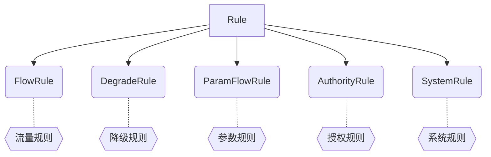
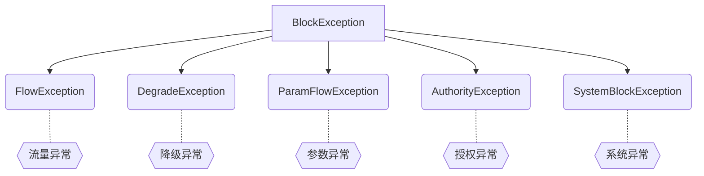

## 一、Nginx
### 1. 普通配置
```sh {2,6,12,13}
server {
    listen       80;
    server_name  localhost;

    location / {
        root   /usr/share/nginx/html;
        index  index.html index.htm;
        try_files $uri $uri/ /index.html;
    }

    location /api/ {
        rewrite ^/api/(.*)$ /$1 break;
        proxy_pass http://localhost:8080;
        proxy_set_header Host $host;
        proxy_set_header X-Real-IP $remote_addr;
    }
}
```

### 2. 反向代理
```sh {2,12}
http {
    upstream mybackend {
        server backend1.example.com:8080;
        server backend2.example.com:8080;
    }

    server {
        listen 80;
        server_name myserver.example.com;

        location / {
            proxy_pass http://mybackend;
        }
    }
}
```

### 3. 反向代理缓存
```sh {2,6}
http {
    proxy_cache_path /data/nginx/cache keys_zone=my_cache:10m;
	
	server {
	    location / {
	        proxy_cache my_cache;
	        proxy_pass http://localhost:8080;
	    }
	}
}
```

### 4. 负载均衡
1. 加权轮询（默认）
2. IP HASH
```sh {7,8}
upstream myapp {
	# 这里添加负载均衡器的节点，比如：
	server 10.0.0.1:8080;
	server 10.0.0.2:8080;
	server 10.0.0.3:8080;
	
	# 配置 IP HASH 负载均衡方式
	ip_hash;
    }
```

### 5. 优化
1. 调整 `worker` 进程数量
2. 调整 `worker` 进程的 `worker_connections` 数量
3. 启动缓存
4. 启用 `Gzip` 压缩
5. 启用 `Keepalive`

## 二、Keepalived
### 1. 普通配置
> 实质是通过**网卡**绑定
```sh {3,8,9,13,17}
! Configuration File for keepalived

global_defs {													# 全局定义
   vrrp_mcast_group4 224.100.100.100
}

vrrp_instance VI_1 {
    state MASTER/BACKUP											# 状态
    interface ens32												# 虚拟网卡
    virtual_router_id 100										# 组虚拟id，同一组中的必须一样
    priority 100												# 权重，主节点必须大于备份节点
    advert_int 1												# 主节点和备份节点的心跳检测时间
    authentication {											# 组身份校验
        auth_type PASS
        auth_pass 1111
    }
    virtual_ipaddress {											# 虚拟IP
        192.168.200.100
    }
}
```

### 2. 集成Nginx

1. Keepalived 配置
> 每隔一段时间，执行检测脚本

```sh {7,25}
! Configuration File for keepalived

global_defs {													# 全局定义
   vrrp_mcast_group4 224.100.100.100
}

vrrp_script chk_nginx {											# 配置脚本
	script "/etc/keepalived/check_nginx.sh"
	interval 1													# 执行间隔
}

vrrp_instance VI_1 {
    state MASTER/BACKUP											# 状态
    interface ens32												# 虚拟网卡
    virtual_router_id 100										# 组虚拟id，同一组中的必须一样
    priority 100												# 权重，主节点必须大于备份节点
    advert_int 1												# 主节点和备份节点的心跳检测时间
    authentication {											# 组身份校验
        auth_type PASS
        auth_pass 1111
    }
    virtual_ipaddress {											# 虚拟IP
        192.168.200.100
    }
	track_script {												# 执行脚本
		chk_nginx
	}
}
```

2. 检测脚本
> 检测 Nginx 是否在工作，如果没有，则做出通知，并关闭 Keepalived

```sh {1}
#!/bin/bash
A=`ps -C nginx --no-header | WC -l`
if [ $A -eq 0 ];then
	# 做出通知
	systemctl stop keepalived		# 关闭
fi
```

### 3. 集成MySQL
检测脚本：

```sh
#!/bin/bash
mysql -u root -p 123456 -e "select version();" >/dev/null 2>&1
if [ $? -ne 0 ];then
	# ...
fi
```

## 三、Nacos
### 1. 服务注册

1. 引入依赖：`spring-cloud-starter-alibaba-nacos-discovery`
2. 注册服务
```yml
spring:
  cloud:
    nacos:
      server-addr: 127.0.0.1:8848				# nacos 地址
      discovery:
        namespace: dev				    		# 命名空间。这里使用 dev 开发环境
```
3. 启用注册功能：在启动类上加上 `@EnableDiscoveryClient` 注解

### 2. 服务配置

1. 引入依赖：`spring-cloud-starter-alibaba-nacos-config`
2. 注册服务
```yml
spring:
  cloud:
    nacos:
      # Nacos Config 配置项，对应 NacosConfigProperties 配置属性类
      config:
        server-addr: 127.0.0.1:8848 			# Nacos 服务器地址
        namespace: dev 							# 命名空间。这里使用 dev 开发环境
        group: DEFAULT_GROUP 					# 使用的 Nacos 配置分组，默认为 DEFAULT_GROUP
        prefix: user-service					# 配置文件前缀，默认是 ${spring.application.name}
        file-extension: yaml 					# 配置格式，默认为 properties
```

::: tip 热更新：
- 通过 `@Value` 注解注入，结合 `@RefreshScope` 来刷新
- 通过 `@ConfigurationProperties` 注入，**自动刷新**
:::

### 3. 集群部署

1. `conf` 目录下 `cluster.conf.example` 文件更改为 `cluster.conf`，内容如下：
```sh
192.168.184.124:8848
192.168.184.125:8848
192.168.184.126:8848
```
2. 准备数据库：`conf` 目录下 `nacos-mysql.sql` 文件

3. `conf` 目录下 `application.properties` 文件更改数据库配置，内容如下：
```properties
#*************** Config Module Related Configurations ***************#
spring.datasource.platform=mysql

db.num=1

db.url.0=jdbc:mysql://127.0.0.1:3306/nacos?characterEncoding=utf8&connectTimeout=1000&socketTimeout=3000&autoReconnect=true&useUnicode=true&useSSL=false&serverTimezone=UTC
db.user.0=nacos
db.password.0=nacos
```
4. Nginx 配置
```sh {10}
http {
	upstream nacos-cluster {
		server 192.168.184.124:8848
		server 192.168.184.125:8848
		server 192.168.184.126:8848
	}
	
	server {
		listen       8848;
		server_name  192.168.184.200;

		location /nacos {
			#root   html;
			#index  index.html index.htm;
			proxy_pass http://nacos-cluster/nacos;
		}
	    }
}


```
5. 项目配置文件更改 Nacos 注册地址为集群地址


## 四、Ribbon

### 1. 基础使用
1. 引入依赖：`spring-cloud-starter-netflix-ribbon`
2. 配置类
```java
@Configuration
public class RibbonConfig {
	
	@Bean
	@LoadBalanced									# 开启负载均衡
	public RestTemplate getRestTemplage() {
		retrun new RestTemplage();
	}
}
```
3. 使用
```java
@Autowired
private RestTemplate restTemplate;
```

::: tip `RestTemplate介绍：`
`RestTemplate` 是 Spring 家族中的一个用于消费第三方 REST 服务的请求框架。`RestTemplate` 实现了对 HTTP 请求的封装，
提供了一套模板化的服务调用方法。通过它，Spring 应用可以很方便地对各种类型的 HTTP 请求进行访问
:::
### 2. 常用负载均衡策略

| 序号 | 实现类                     | 策略                                                               |
| ---- | -------------------------- | ------------------------------------------------------------------ |
| 1    | `ZoneAvoidanceRule`        | **默认**的负载均衡策略，区域内轮询                                 |
| 2    | `RoundRobinRule`           | 线性轮询                                                           |
| 3    | `RandomRule`               | 随机                                                               |
| 4    | `WeightedResponseTimeRule` | 平均响应时间加权，平均响应时间越短的服务实例权重越高，选中概率越大 |

### 3. 配置负载均衡策略

1. 配置文件

```yaml
user-service:
	ribbon:
	  NFLoadBalancerRuleClassName: com.netflix.loadbalancer.RandomRule # 随机负载均衡策略
```

2. 注入 Bean

```java {2,6,7}
@Configuration
@RibbonClient(name = "service-provider", configuration = RibbonConfiguration.class)
public class RibbonConfiguration {
	
    @Bean
    public IRule ribbonRule() {
        return new RandomRule(); // 随机负载均衡策略
    }
}
```

3. 改变 RestTemplate 配置（略）


## 五、OpenFeign

### 1. 基础使用
1. 引入依赖：`spring-cloud-starter-openfeign`
2. 启用 Feign 客户端功能：
```java {2}
@SpringBootApplication
@EnableFeignClients //开启 OpenFeign 功能
public class OpenFeignApplication {
    public static void main(String[] args) {
        SpringApplication.run(OpenFeignApplication.class, args);
    }
}
```
3. 服务提供者注册服务
4. 在消费者中添加调用提供者的接口
```java {2}
// 服务提供者提供的服务名称，即 application.name
@FeignClient(value = "user-service")
public interface FeignUserService {
    //对应服务提供者（8001、8002、8003）Controller 中定义的方法
    @RequestMapping(value = "/dept/get/{id}", method = RequestMethod.GET)
    public User getUserById(@PathVariable("id") int id);
}
```
5. 调用
```java {5}
@Service
public class DeptController_Consumer {
    
    @Resource
    private FeignUserService feignUserService;				// 注入 OpenFeignClient 类
	
    public User getUserById(Integer id) {
        return feignUserService.getUserById(id);
    }
}
```

### 2. OpenFeign 日志
**`Logger.Level`** 的具体级别如下：
- `NONE`：不记录任何信息。
- `BASIC`：仅记录请求方法、URL 以及响应状态码和执行时间。
- `HEADERS`：除了记录 BASIC 级别的信息外，还会记录请求和响应的头信息。
- `FULL`：记录所有请求与响应的明细，包括头信息、请求体、元数据等等。

:::tip
因 OpenFeign 是消费者调用提供者，所以日志应在消费者服务中配置，共有三步：
:::
1. 配置文件

```yaml {3}
logging:
  level:
    # com.tinkin.feign 表示 OpenFeignClient 的包名
    com.tinkin.feign: DEBUG
```

2. Bean 注入

```java {6}
@Configuration
public class OpenFeignLoggerConfig {

    @Bean
    Logger.Level feginLoggerLevel() {
        return Logger.Level.FULL;
    }
}
```

3. 指定日志(两种)：

**指定 OpenFeign 客户端日志类型：**

```java
@FeignClient(name = "user-service", configuration = OpenFeignLoggerConfig.class)
```

**指定全局日志类型（需加上配置文件日志，且配置文件日志级别比 Bean 注入日志级别低）：**

```java
@EnableFeignClients(defaultConfiguration = OpenFeignLoggerConfig.class)
```


## 六、GateWay
### 1. 基础使用
1. 引入依赖：`spring-cloud-starter-gateway`
2. 配置

```yaml
spring:
  cloud:
    gateway: 
      routes:
        - id: provider-router
          uri: lb://provider-service
          predicates:
            - Path=/user/**
          filters:
            - PrefixPath=/system #在请求路径前面加上 /system

# 最低日志级别: 能够打印出匹配到哪条规则及匹配结果
logging:
  level:
    org:
	  springframework:
	    cloud:
		  gateway: trace
```

### 2. 自定义全局过滤器

```java {3,17,18}
@Component
@Order("1")
public class MyGlobalFilter implements GlobalFilter {
    @Override
    public Mono<Void> filter(ServerWebExchange exchange, GatewayFilterChain chain) {
		
        log.info("进入自定义的全局过滤器 MyGlobalFilter : " + new Date());
		
		// 前置处理
        String uname = exchange.getRequest().getQueryParams().getFirst("uname");
        if (uname == null) {
            log.info("参数 uname 不能为 null！");
            exchange.getResponse().setStatusCode(HttpStatus.NOT_ACCEPTABLE);
            return exchange.getResponse().setComplete();
        }
		
		// 无后置处理则是： return chain.filter(exchange);
        return chain.filter(exchange).then(Mono.fromRunnable( () -> {
			// 后置处理
			log.info("后置处理");
		} ));
    }
}
```


## 七、Sentinel
### 1. 基础使用
1. 引入依赖：`spring-cloud-starter-alibaba-sentinel`
2. 配置
```yaml
spring:
  cloud:
    sentinel:
      transport:
        dashboard: 127.0.0.1:8888			# Sentinel控制台地址
		port: 8719							# Sentinel控制台与客户端通信端口
```

### 2. 关键类

##### 规则：`Rule` 接口



##### 异常：`BlockException` 类



##### `@SentinelResource` 注解

| 属性                 | 说明                                                                                                        |
| -------------------- | ----------------------------------------------------------------------------------------------------------- |
| `value`              | 用于指定资源的名称                                                                                          |
| `entryType`          | entry 类型(出站流量/入站流量)，默认 EntryType.OUT                                                           |
| `blockHandler`       | 用来指定方法发生 `BlockException` 时的回调函数，偏向于破坏 Sentinel 规则时的后续处理                        |
| `blockHandlerClass`  | 若 blockHandler 方法与原方法不在同一个类中，则需该属性指定 blockHandler 方法所在的类(必须指定 blockHandler) |
| `fallback`           | 当方法发生异常时的回调方法，偏向于程序出现异常时的后续处理                                                  |
| `fallbackClass `     | 类同 `blockHandlerClass`                                                                                    |
| `defaultFallback`    | 指定默认的 fallback 方法名称，通常用于通用的 fallback 逻辑                                                  |
| `exceptionsToIgnore` | 排除异常，会原样抛出                                                                                        |


### 3. 规则
##### 流量控制


###### 自定义流量控制规则：
```java {1,3,11}
@SentinelResource(value = "test-resource") 				//通过注解定义资源
public String testD() {
    initFlowRules(); 									//调用初始化流控规则的方法
    // 方法操作
    return "访问成功 ------ success";
}

/**
 * 通过代码定义流量控制规则
 */
private static void initFlowRules() {
    List<FlowRule> rules = new ArrayList<>();
    //定义一个限流规则对象
    FlowRule rule = new FlowRule();
    //资源名称
    rule.setResource("testD-resource");
     //限流阈值的类型
    rule.setGrade(RuleConstant.FLOW_GRADE_QPS);
    // 设置 QPS 的阈值为 2
    rule.setCount(2);
    rules.add(rule);
    //定义限流规则
    FlowRuleManager.loadRules(rules);
}
```

###### 流控模式

- <b>直接：</b>直接对当前资源限流
- <b>关联：</b>当关联资源超过阈值后，对当前资源限流(俩资源是平等竞争关系)
- <b>链路：</b>当通过链路资源到达当前资源的请求超过阈值后，对链路资源限流(限制：链路资源必须调用当前资源)

###### 流控效果

- <b>快速失败 ：</b> 默认的流量控制方式，当 QPS 超过任意规则的阈值后，新的请求就会被立即拒绝，拒绝方式为抛出 `FlowException` 异常
- <b>Warm Up：</b>让通过的流量缓慢增加，在一定时间内逐渐增加到阈值上限，给冷系统一个预热的时间
- <b>排队等待 ：</b> 这种方式严格控制了请求通过的间隔时间，也即是让请求以均匀的速度通过，对应的是漏桶算法

##### 熔断降级


###### 自定义熔断降级规则：

```java {1,3,4,10,30}
@SentinelResource(value = "getUserById")
public User getById(@PathVariable("id") int id) {
    initDegradeRule();
    monitor();
    return userService.getById(id);
}
/**
 * 熔断策略
 */
private static void initDegradeRule() {
    List<DegradeRule> rules = new ArrayList<>();
    DegradeRule rule = new DegradeRule("fallback");
    //熔断策略为异常比例
    rule.setGrade(CircuitBreakerStrategy.ERROR_RATIO.getType());
    //异常比例阈值
    rule.setCount(0.7);
    //最小请求数
    rule.setMinRequestAmount(100);
    //统计市场，单位毫秒
    rule.setStatIntervalMs(30000);
    //熔断市场，单位秒
    rule.setTimeWindow(10);
    rules.add(rule);
    DegradeRuleManager.loadRules(rules);
}

/**
 * 自定义事件监听器，监听熔断器状态转换
 */
public void monitor() {
	EventObserverRegistry.getInstance().addStateChangeObserver("logging",
		(prevState, newState, rule, snapshotValue) -> {
			SimpleDateFormat format = new SimpleDateFormat("yyyy-MM-dd HH:mm:ss");
			if (newState == CircuitBreaker.State.OPEN) {
				// 变换至 OPEN state 时会携带触发时的值
				System.err.println(String.format("%s -> OPEN at %s, 发送请求次数=%.2f", prevState.name(),
						format.format(new Date(TimeUtil.currentTimeMillis())), snapshotValue));
			} else {
				System.err.println(String.format("%s -> %s at %s", prevState.name(), newState.name(),
						format.format(new Date(TimeUtil.currentTimeMillis()))));
			}
		});
}
```
###### 熔断策略

- <b>慢调用比例 ：</b> 请求超时数与总请求数的比值超过比例阈值，则熔断开启
- <b>异常比例 &nbsp; &nbsp; ：</b>请求异常数与总请求数的比值超过比例阈值，则熔断开启
- <b>异常数 &nbsp; &nbsp; &nbsp; &nbsp;：</b> 请求异常数超过比例阈值，则熔断开启

##### 热点参数限流

<!--  -->

##### 授权规则

<!--  -->

##### 系统规则


::: tip
在触发这些已设定的规则时，会开启系统保护
:::

### 4. 集成 OpenFeign

```yaml
# 激活 Sentinel 对 Feign 的支持
feign:
  sentinel:
    enabled: true
```


<p/><p/><p/><p/><p/><p/><p/>

## 十、Mycat
官网：[https://www.yuque.com/ccazhw/ml3nkf](https://www.yuque.com/ccazhw/ml3nkf)


### 1. MySQL主从复制(读写分离)


1. 主节点配置文件
```sh
[mysqld]
## 设置server_id，同一局域网中需要唯一
server_id=1
## 指定不需要同步的数据库名称
#binlog-ignore-db=mysql  
## 指定需要同步的数据库名称  
binlog-do-db=mydb1
## 开启二进制日志功能  
#记录所有更改数据的语句，可以用于主从服务器之间的数据同步，以及服务器遇到故 障时数据的无损失恢复。
log-bin=mysql-bin  
## 设置二进制日志使用内存大小（事务）
binlog_cache_size=1M  
## 设置使用的二进制日志格式（mixed,statement,row）
binlog_format=mixed
#statement 记录所有的写操作到bin-log文件 缺点:sql语句执行set time=now() 会出现主从不一致  
#row 记录每行的变换  缺点:数据量大的时候,记录数据多
#mixed是statement和row的混合  
## 二进制日志过期清理时间。默认值为0，表示不自动清理。
expire_logs_days=7  
## 跳过主从复制中遇到的所有错误或指定类型的错误，避免slave端复制中断。
## 如：1062错误是指一些主键重复，1032错误是因为主从数据库数据不一致
slave_skip_errors=1062
 
## 通用查询日志
#记录所有连接的起始时间和终止时间，以及连接发送给数据库服务器的所有指令， 对我们复原操作的实际场
#景、发现问题，甚至是对数据库操作的审计都有很大的帮助。
general_log=ON  
general_log_file=/var/lib/mysql/mysql-general.log 
 
## 慢查询日志
#记录所有执行时间超过long_query_time的所有查询，方便我们对查询进行优化。
slow_query_log=ON 
slow_query_log_file=/var/lib/mysql/mysql-slow.log 
long_query_time=3 
## 设置慢查询的阈值为3秒，超出此设定值的SQL即被记录到慢查询日志
log_output=FILE
max_allowed_packet=200M
 
## 错误日志
#记录MySQL服务的启动、运行或停止MySQL服务时出现的问题，方便我们了解服务器的 状态，从而对服务器进行维护。
log-error=/var/lib/mysql/mysql-error.log

datadir=/var/lib/mysql
socket=/var/lib/mysql/mysql.sock
pid-file=/var/run/mysqld/mysql.pid
```

配置完成后重启主机

2. 从节点配置文件
```sh
[mysqld]
## 设置server_id，同一局域网中需要唯一
server_id=2
## 指定不需要同步的数据库名称
#binlog-ignore-db=mysql
binlog-do-db=mydb1
## 开启二进制日志功能，以备Slave作为其它数据库实例的Master时使用
log-bin=mysql-slave 
## 设置二进制日志使用内存大小（事务）
binlog_cache_size=1M  
## 设置使用的二进制日志格式（mixed,statement,row）
binlog_format=mixed  
## 二进制日志过期清理时间。默认值为0，表示不自动清理。
expire_logs_days=7  
## 跳过主从复制中遇到的所有错误或指定类型的错误，避免slave端复制中断。
## 如：1062错误是指一些主键重复，1032错误是因为主从数据库数据不一致
slave_skip_errors=all 
 
## relay_log配置中继日志
#用于主从服务器架构中，从服务器用来存放主服务器二进制日志内容的一个中间文件。 从服务器通过读取中继#日志的内容，来同步主服务器上的操作。
relay_log=mysql-relay
## log_slave_updates表示slave将复制事件写进自己的二进制日志
log_slave_updates=1  
## slave设置为只读（具有super权限的用户除外）
read_only=1

datadir=/var/lib/mysql
socket=/var/lib/mysql/mysql.sock
pid-file=/var/run/mysqld/mysql.pid
```

配置完成后重启从机

3. 在主机上设置专门用于主从复制的用户
```sql
CREATE USER 'slave'@'%' IDENTIFIED BY '123456';

ALTER USER 'slave'@'%' IDENTIFIED WITH mysql_native_password BY '123456';

GRANT REPLICATION SLAVE on *.* TO 'slave'@'%';

FLUSH PRIVILEGES;

SHOW MASTER STATUS;
```
4. 在从机上配置主机信息
```sql
CHANGE MASTER TO MASTER_HOST='192.168.184.124', MASTER_USER='slave', MASTER_PASSWORD='123456', MASTER_LOG_FILE='mysql-bin.000001', MASTER_LOG_POS='1153';
-- MASTER_LOG_FILE 填写：主机状态的File     MASTER_LOG_POS填写：主机状态的Position

START SLAVE;								-- 启动从机的复制功能

SHOW SLAVE STATUS\G;						-- 查看从服务器状态
```

### 2. mycat 配置主从复制

##### 创建数据源

> 有两种方式：执行命令、配置文件

1. 执行命令

```sql
/*+ mycat:createDataSource{
 "name":"test1",
 "url":"jdbc:mysql://192.168.171.142:3306/mydb1?useSSL=false&characterEncoding=UTF-8&useJDBCCompliantTimezoneShift=true", 
 "user":"root",
 "password":"123456",
 "instanceType":"WRITE"
 } */;
```

2. 配置文件

> 在 `conf/datasources` 目录下，文件名格式是：`${name}.datasource.json`

```json
{
	"dbType":"mysql",
	"idleTimeout":60000,
	"initSqls":[],
	"initSqlsGetConnection":true,
	"instanceType":"WRITE",
	"logAbandoned":true,
	"maxCon":1000,
	"maxConnectTimeout":30000,
	"maxRetryCount":5,
	"minCon":1,
	"name":"test1",
	"password":"root",
	"queryTimeout":0,
	"removeAbandoned":false,
	"removeAbandonedTimeoutSecond":180,
	"type":"JDBC",
	"url":"jdbc:mysql://192.168.171.142:3306/mydb1?serverTimezone=Asia/Shanghai&useJDBCCompliantTimezoneShift=true&characterEncoding=UTF-8&useUnicode=true&autoReconnect=true&useSSL=false",
	"user":"root",
	"weight":0
}
```

::: tip 查看所有数据源：
`/*+ mycat:showDataSources{} */`，重复创建其实是修改
:::

##### 创建集群

> 有两种方式：执行命令、配置文件

1. 执行命令

```sql
/*+ mycat:createCluster{"name":"cluster0","masters":["master0"],"replicas":["read0"]} */;
```

2. 配置文件

> 在 `conf/clusters` 目录下，文件名格式是：`xxx.cluster.json`

```json
{
	"clusterType":"MASTER_SLAVE",
	"heartbeat":{
		"heartbeatTimeout":1000,
		"maxRetry":3,
		"minSwitchTimeInterval":300,
		"slaveThreshold":0
	},
	"masters":[
		"master0"
	],
	"maxCon":200,
	"name":"cluster0",
	"readBalanceType":"BALANCE_ALL",
	"switchType":"SWITCH",
        "replicas":[
                 "slave0"
        ]
}
```

::: tip 查看所有集群节点：
`/*+ mycat:showClusters{} */`，重复创建其实是修改
:::

##### 完善逻辑库

1. 在 mycat 中创建逻辑库。

> 两种方式：1.执行命令 `create database mydb1;`   2. 在 `conf/schema` 目录下创建文件 `mydb1.schema.json`。

2. 建立逻辑库和物理库之间的关系

修改文件 `mydb1.schema.json`：

```json {7}
{
	"customTables":{},
	"globalTables":{},
	"normalProcedures":{},
	"normalTables":{},
	"schemaName":"mydb1",
    "targetName":"124-master",
	"shardingTables":{},
	"views":{}
}
```

### 3. 双集群

> 1主1备2从（主主复制*2 + 主从复制*2）


::: tip 关键点：
1. 两个主节点会相互复制，所以都要配置 `relay-log`
2. 两个主节点的数据为互补关系，所以要更改自增设置
3. 两个主节点还要各新建用户用以将 `bin log` 推送到对方节点
:::

**mycat 配置：**

```json {3,4}
/*! mycat:createCluster{
 "name":"prototype",
 "masters":["master1","master2"],
 "replicas":["slave1",slave2]} 
*/
```

### 4. 分库分表

##### 环境


::: tip 配置文件：
**`conf/schemas/xxx.schema.json`**
:::

##### 广播表（全局表）

<!-- 1. 创建表的sql
2. mycat配置信息映射关系
3. mycat逻辑表和mysql物理表映射关系 -->

```sql {10}
create table CODE_DICTIONARY
(
    DICID int not null AUTO_INCREMENT PRIMARY KEY comment '字典id',
    DICNAME varchar(128) not null comment '字典名称',
    DICVALUE varchar(500) not null comment '字典值',
    PARENTID int null comment '父id',
    DESCRIPTION varchar(200) null comment '描述',
    STATUS int null comment '是否启用：1表示启用，0表示不启用',
    DICTYPE varchar(200) not null comment '字典类型'
)comment '字典表' BROADCAST;
```

::: tip mydb1.schema.json
```json
"globalTables":{
	"CODE_DICTIONARY":{
		"broadcast":[
			{
				"targetName":"c0"
			},
			{
				"targetName":"c1"
			}
		],
		"createTableSQL":"xxx"
	}
}
```
:::


##### 分片表

```sql {7}
create table `ORDERS`
(
    ID int not null AUTO_INCREMENT PRIMARY KEY comment '订单id',
    ORDER_TYPE int comment '订单类型',
    CUSTOMER_ID int comment '顾客id'
)comment '订单表'
dbpartition BY mod_hash(CUSTOMER_ID) tbpartition BY mod_hash(CUSTOMER_ID) dbpartitions 2 tbpartitions 1;

CREATE TABLE `USER`
(
    ID INT NOT NULL AUTO_INCREMENT PRIMARY KEY COMMENT '用户id',
    USERNAME VARCHAR(200) COMMENT '用户名',
    NICKNAME VARCHAR(200) COMMENT '昵称',
    PASSWORD VARCHAR(20) COMMENT '密码'
)COMMENT '用户表'
dbpartition BY mod_hash(username) tbpartition BY mod_hash(username) dbpartitions 2 tbpartitions 1;
```

::: tip mydb1.schema.json
```json
"shardingTables":{
	"ORDERS":{
		"createTableSQL":"xxx",
		"function":{
			"properties":{
				"dbNum":"2",
				"mappingFormat":"c${targetIndex}/mydb1_${dbIndex}/orders_${index}",
				"tableNum":"1",
				"tableMethod":"mod_hash(CUSTOMER_ID)",
				"storeNum":2,
				"dbMethod":"mod_hash(CUSTOMER_ID)"
			}
		},
		"shardingIndexTables":{}
	},
	"USER":{
		"createTableSQL":"xxx",
		"function":{
			"properties":{
				"dbNum":"2",
				"mappingFormat":"c${targetIndex}/mydb1_${dbIndex}/user_${index}",
				"tableNum":"1",
				"tableMethod":"mod_hash(username)",
				"storeNum":2,
				"dbMethod":"mod_hash(username)"
			}
		},
		"shardingIndexTables":{}
	}
}
```
:::


##### ER 表

```sql {10}
create table ORDER_DETAILS
(
    ID int AUTO_INCREMENT PRIMARY KEY comment 'id',
    ORDER_ID int not null comment '订单id',
    CUSTOMER_ID int not null comment '顾客id',
    PRODUCT_ID int not null comment '商品id',
    PRICE DECIMAL(10, 2) NOT NULL comment '单价，小数表示',
    COUNT int not null comment '商品个数'
)comment '订单详情表'
dbpartition BY mod_hash(CUSTOMER_ID) tbpartition BY mod_hash(CUSTOMER_ID) dbpartitions 2 tbpartitions 1;
```

::: tip mydb1.schema.json
```json
"shardingTables":{
	"ORDER_DETAILS":{
		"createTableSQL":"xxx",
		"function":{
			"properties":{
				"dbNum":"2",
				"mappingFormat":"c${targetIndex}/mydb1_${dbIndex}/order_details_${index}",
				"tableNum":"1",
				"tableMethod":"mod_hash(CUSTOMER_ID)",
				"storeNum":2,
				"dbMethod":"mod_hash(CUSTOMER_ID)"
			}
		},
		"shardingIndexTables":{}
	}
}
```
:::


### 4. 分片算法


